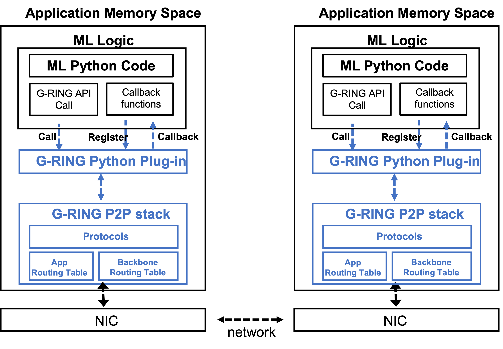

# Introduction

This repository contains implementation of G-RING: the resilient decentralized communication protocol and systems designs for distributed services.



# Installation

1. Install Go
This repository is valided with, but not limited to, go1.16
```bash
wget https://golang.org/dl/go1.16.linux-amd64.tar.gz
sudo tar -C /usr/local -xzf go1.16.linux-amd64.tar.gz
```

# Write your own distributed service example
distributed service applications can be implemented on G-RING.

Please refer to examples in G-RING/cmd

## Node Creation
This is a G-RING core data structure that contains management resources such as event handling(e.g., connection management), message handler, overlay network.
```bash
node, err = GRING.NewNode(
            GRING.WithNodeBindHost(net.ParseIP(host)),
            GRING.WithNodeBindPort(uint16(port)),
            GRING.WithNodeMaxRecvMessageSize(1<<24),
            )
```

## Register Message Handlers
```bash
//Register the chatMessage structure to the node with an associated unmarshal function.
node.RegisterMessage(chatMessage{}, unmarshalChatMessage)

// Register a message handler to the node.
node.Handle(handle)
```

## Register Overlay Network Routing Protocol
```bash
// This example uses Dual protocol.
events = dual.Events{
             OnPeerAdmitted: func(id GRING.ID) {
                fmt.Printf("Learned about a new peer %s(%s).\n", id.Address, id.ID.String()[:printedLength])
	     }
             OnPeerEvicted: func(id GRING.ID) {
                fmt.Printf("Forgotten a peer %s(%s).\n", id.Address, id.ID.String()[:printedLength])
             },
        }
// register above events handlers to Dual 
overlay = dual.New(dual.WithProtocolEvents(events)

// Bind Dual Overlay to the node.
node.Bind(overlay.Protocol())
```
## Start the node
```bash
// Have the node start listening for new peers.
node.Listen()
```

# Setting parameters
G-RING provides below protocols. Please refer to below named directory on the top directory of G-RING

## dual
Default routing and messaging protocol for G-RING. 
It provides three communication protocols and two types of overlays.

```bash
Communication protocols
A. P2P Backbone Connection Management Protocol
B. P2P Backbone General Purpose Communication Protocol 
C. P2P Application Communication Protocol
```
```bash
Overlays
A. Backbone overlay
B. Application overlay
```
## kademlia
Vanilla Kademlia 

## gossip
standard push based gossip protocol


# Supported Platforms

Tested environment:

OS : Ubuntu 18.04
Hardware : Ethernet


# Status
The code is provided as is, without warranty or support.

Some of codes(e.g., Kademlia, gossip) are from Noise
https://github.com/perlin-network/noise

